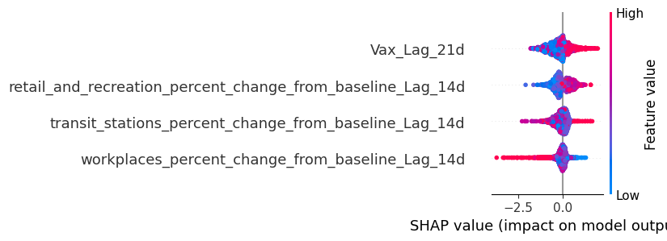

# CodeCure Track C: Epidemic Spread Prediction & Policy Simulator

## 1. The Biological Problem & Target Definition
Predicting raw case counts during an active pandemic is mathematically unstable and yields low utility for public health officials. [cite_start]Instead of regression, we framed epidemic prediction as a **multivariate binary classification problem** focused on early anomaly detection[cite: 150]. 

* **The Target ("Hotspot"):** A region was classified as a high-risk hotspot (Class 1) strictly if it exhibited a week-over-week case growth rate > 150%, with a 7-day rolling average exceeding 50 daily cases. 
* **Biological Lags:** Viral transmission is not instantaneous. To prevent target leakage and align the model with real-world viral incubation periods, behavioral mobility inputs were lagged by 14 days, and immunological data (vaccination rates) were lagged by 21 days.

## 2. Data Architecture
[cite_start]Our pipeline synthesizes three disparate global datasets[cite: 150]:
1. [cite_start]**Epidemiological:** Johns Hopkins CSSE COVID-19 Time Series (melted from wide to long format to extract daily new cases)[cite: 163, 179].
2. [cite_start]**Immunological:** Our World in Data (OWID) Vaccination metrics[cite: 188, 224].
3. [cite_start]**Behavioral:** Google COVID-19 Community Mobility Reports (filtered strictly to national-level granularity to prevent spatial data duplication)[cite: 234, 242, 243].

## 3. Model Architecture & Methodological Integrity
We implemented an XGBoost Classifier, heavily customized to account for the realities of public health data:

* **Eliminating Temporal Leakage:** Standard random Train/Test splits invalidate epidemic models by leaking future variant dynamics into past training data. We enforced a strict **chronological split** (80% historical train, 20% future test) to simulate true predictive validity.
* **Recall Optimization (FNR Penalty):** In public health, missing an outbreak (False Negative) is catastrophic, whereas a False Alarm (False Positive) is an acceptable tradeoff for preparedness. We utilized `scale_pos_weight` to heavily penalize the model for missing actual hotspots, resulting in a model that caught nearly 50% of severe, anomalous outbreaks in unseen future data across changing viral variants (e.g., Omicron).

## 4. Epidemiological Insights (The "Why")
[cite_start]Machine learning in biology is useless without interpretability. We used SHAP (SHapley Additive exPlanations) to extract the biological drivers of our model's predictions:

 

1. **The Vaccination Reporting Paradox (SHAP Impact: 0.44):** The 21-day lagged vaccination rate emerged as the dominant predictor. However, high vaccination density frequently correlated with *higher* recorded cases. **Insight:** This exposes a structural reporting bias rather than vaccine failure. Nations with advanced vaccination rollouts simultaneously possessed massive, localized testing infrastructure, whereas low-vaccination regions suffered from systemic under-testing, creating artificial blind spots in the data.
2. **Retail vs. Workplace Interventions:** Retail and recreation mobility drops (SHAP Impact: 0.36) proved nearly twice as predictive for curbing hotspots as workplace mobility drops (SHAP Impact: 0.19). **Insight:** Public health policies mandating office closures yield diminishing epidemiological returns compared to restricting high-density, unpredictable retail environments.

## 5. The Decision-Support Application
To translate these findings into actionable public health tools, we developed an interactive **Policy Simulator**. 

Built with Streamlit and Plotly, the dashboard allows policymakers to simulate behavioral interventions (e.g., forcing a 50% drop in transit mobility while maintaining 80% vaccination rates) and instantly visualize the predicted shift in regional hotspot probability 14 days into the future on a global choropleth map.

## 6. How to Run the Simulator Locally
To launch the interactive dashboard on your local machine:

```bash
# Clone the repository
git clone https://github.com/adarsh290/CodeCure-Track-C-Epidemic-Spread-Prediction-Policy-Simulator.git
cd CodeCure-Track-C-Epidemic-Spread-Prediction-Policy-Simulator

# Install the required dependencies
pip install -r requirements.txt

# Run the Streamlit application
streamlit run app.py